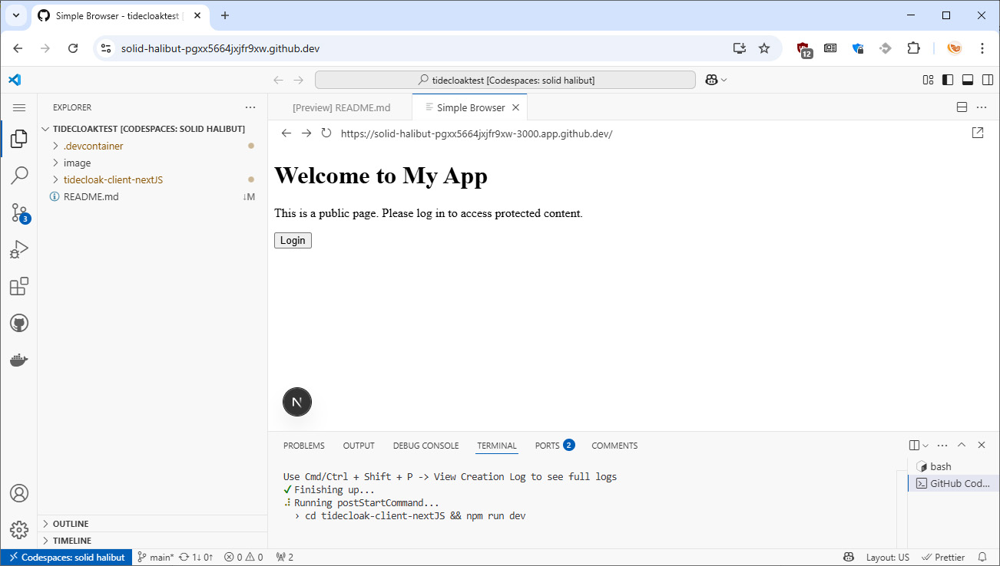

# TideCloak developer demo 🚀

Build the most secure demo web app using TideCloak SDK instantly with GitHub Codespaces - no setup required!

The only prerequisit: a (free) github account!

---

## **1. Fork the repo** ✅

Click the button below to **fork** your copy (C'mon, I said "fork!"):

It will auto-populate the **"Create a new repository"** form - and you only need to give it a Repository name e.g. "*mytidecloaktest*" - and click `Create repository`

## 2. Launch your Codespace 🚀

✅ Now that you've forked the repo, launch the project in your Codespace to spin up a fully working Next.js demo app secured by TideCloak - A bare-bones web app showing off TideCloak's core features, to remove your worry of breaches:

1. Go to **Code → Codespaces**
2. Select **"Create codespace on main"** on the `main` branch

**While you wait (7 mins or so), here's what happens automatically:**
- Clone the TideCloak Next.js demo app (You can check the full repo [here](https://github.com/tide-foundation/tidecloak-client-nextJS))
- Install dependencies
- Pull and run your own TideCloak Docker service (tideorg/tidecloak-dev:latest) on port 8080
- Set up the entire demo organization within TideCloak, license and activate it
- Create and install your specific tidecloak.json adaptor config
- Start the Next.js app on port 3000

Feel free to grab a coffee, star this project, or read about the latest breach headlines, that won't bother you when you're TideCloak'ed

## **3. Have a play with the demo app** ▶️

**a) Tiny manual adjustment needed!**

> [!IMPORTANT]
> For this to work, you must make port 8080 public to allow your app to access Tidecloak.
_(Currently GitHub restricts us from automating this step, so you'll have to do it manually)_

Go to the Ports tab in Codespaces, find port `Tidecloak Server (8080)`, and right-click → `Port visibility` → 'Public'

**b) Your Next.js app secured by Tidecloak is now ready for you to take for a spin**

The Preview opens automatically, otherwise check the **Ports tab** in Codespaces for the **Forwarded addess** in the format of _https://${CODESPACE_NAME}-3000.app.github.dev_.

You should see this:

> [!WARNING]
> When you click `Login` for the first time, you'll see the below Github warning. Just press `Continue` to move on.

**4. Accessing the TideCloak backend**
------------------------------------------------

Then in the **Ports tab** click on the **Forwarded addess** in the format of _https://${CODESPACE_NAME}-8080.app.github.dev_. The default administrator credentials are `admin` / `password`.
